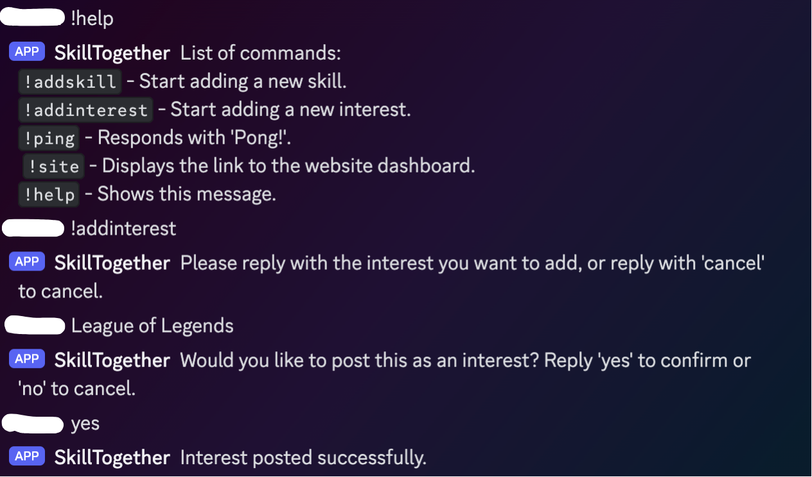

# SkillTogether

SkillTogether is a project that connects users through their skills and interests. Users can add, search, and manage their skills and interests using a Discord bot, a RESTful API, and a web frontend.

You can add skills or interests that you are interested in by messaging the bot, and they will be associated with your Discord profile. On the website, you can search and then contact someone through a link to their profile if you have similar interests or they have listed a skill you want to learn or teach.

<p align="center">
  
</p>

## Why?

Some friends in the past have wanted more methods to find people with similar interests, and a few have wished for a way to learn new skills from individuals without it being a financial transaction.

At the same time, I wanted to make it more integrated with Discord. After authorizing the bot, it can be used to add interests or skills. Once the user has found what they are interested in through the website, they are linked to another profile on Discord and they can interact there.

## Table of Contents

- [Features](#features)
- [Bot Commands](#commands)
- [API Endpoints](#endpoints)
- [Installation](#install)
- [Environment Variables](#variables)
- [Usage](#usage)
- [Contributing](#contributing)

## <a name="features">Features</a>

- **Discord Bot**: Add skills and interests via Discord commands.
- **RESTful API**: Manage skills, interests, and user data.
- **Web Frontend**: Interface to interact with the platform and search for other people to connect with.

## <a name="commands">Bot Commands</a>

The Discord bot supports the following commands currently:

- `!addskill`: Start adding a new skill.
- `!addinterest`: Start adding a new interest.
- `!ping`: Responds with "Pong!".
- `!help`: Shows the list of available commands.
- `!site`: Provides a link to the site dashboard.

## <a name="endpoints">API Endpoints</a>

### Authorization

- `GET /me`: Get the current user's information.

### Skill Routes

- `GET /api/skills`: Get all skills.
- `GET /api/skills/:id`: Get a specific skill by ID.
- `POST /api/skills`: Add a new skill.
- `PUT /api/skills/:id`: Update a specific skill by ID.
- `DELETE /api/skills/:id`: Delete a specific skill by ID.
- `GET /api/search/skills`: Search for skills including user info.

### Interest Routes

- `GET /api/interests`: Get all interests.
- `GET /api/interests/:id`: Get a specific interest by ID.
- `POST /api/interests`: Add a new interest.
- `PUT /api/interests/:id`: Update a specific interest by ID.
- `DELETE /api/interests/:id`: Delete a specific interest by ID.
- `GET /api/search/interests`: Search for interests including user info.

### User Routes

- `PUT /api/users/:discord_id`: Update a user's information by Discord ID.
- `GET /api/users/:discord_id`: Get a user by Discord ID.
- `DELETE /api/users/:discord_id`: Delete a user by Discord ID.

### Bot Routes

- `POST /bot/skills`: Add a new skill via the bot.
- `POST /bot/interests`: Add a new interest via the bot.

## <a name="install">Installation</a>

1. **Clone the repository**:

   ```sh
   git clone https://github.com/DavAnders/SkillTogether.git
   cd SkillTogether
   ```

2. **Backend setup**:

   - Navigate to the backend directory:
     ```sh
     cd backend
     ```
   - Install dependencies and run migrations:
     ```sh
     go mod tidy
     goose up
     ```
   - Start the server:
     ```sh
     go run main.go
     ```

3. **Frontend setup**:

   - Navigate to the frontend directory:
     ```sh
     cd frontend
     ```
   - Install dependencies:
     ```sh
     npm install
     ```
   - Start the development server:
     ```sh
     npm run dev
     ```

4. **Bot setup**:
   - Create a bot on the Discord Developer Portal.
   - Add the bot token and other required environment variables to your `.env` file:
     ```sh
     DISCORD_BOT_TOKEN=your-bot-token
     ```
   - Start the bot:
     ```sh
     go run bot/bot.go
     ```

## <a name="variables">Environment Variables</a>

The project uses several environment variables for configuration. You will need a `.env` file in the project root directory and in the frontend directory. Below is a list of all the necessary environment variables:

### Frontend

This .env file needs to be in the frontend directory.

- `VITE_CLIENT_ID`: Discord client ID.
- `VITE_REDIRECT_URI`: Redirect URI for Discord OAuth.
- `VITE_BASE_URL`: Base URL for the backend.

### Backend and Bot

This .env file needs to be in the root directory.

- `DISCORD_BOT_TOKEN`: Token for the Discord bot.
- `DB_HOST`: Database host.
- `DB_NAME`: Database name.
- `DB_USER`: Database user.
- `DB_PASSWORD`: Database password.
- `DB_PORT`: Database port.
- `DB_SSLMODE`: Database SSL mode.
- `CLIENT_ID`: Discord client ID (same as frontend).
- `CLIENT_SECRET`: Discord client secret.
- `REDIRECT_URL`: Redirect URI for Discord OAuth.
- `API_URL`: Base URL for the API.
- `MY_API_KEY`: API key for bot authentication.
- `FRONTEND_URL`: URL for the frontend.

## <a name="usage">Usage</a>

**Interacting with the bot**: Use the Discord bot commands to add skills and interests. `!help` displays a list of commands.

**Frontend**: Discord OAuth currently handles the login for the website. You can view, add, edit, delete your skills and interests when logged in and search for others.

## <a name="contributing">Contributing</a>

1. Fork the repository.
2. Create a new branch:
   ```sh
   git checkout -b feature-branch
   ```
3. Make your changes and commit them:
   ```sh
   git commit -m "Add some feature"
   ```
4. Push to the branch:
   ```sh
   git push origin feature-branch
   ```
5. Open a pull request.
